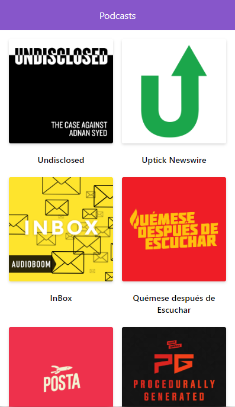

# Next.js Platzi Course Project

Podcast application made in Next.js using the [AudioBoom API](https://api.audioboom.com/channels/recommended/), with this application I learned how to use Next.js.

[View the App](https://podcast.tuentyfaiv.vercel.app/)

## How does it work?

Require Node.JS

* `npm install` to install the dependencies.
* `npm run dev` for the development environment.
* `npm run build && npm start` for the production environment.

## License

MIT
